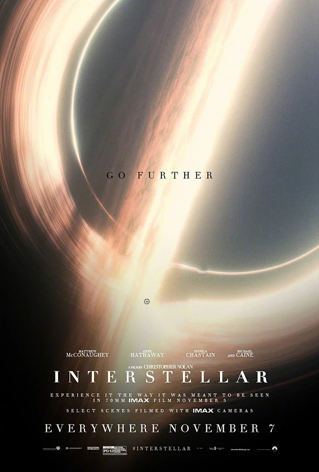

# ArikaShow 🌌

<div align="center">



**深空 · 技术作品集 | Deep Space Tech Portfolio**

[](LICENSE)
[](https://developer.mozilla.org/en-US/docs/Web/Guide/HTML/HTML5)
[](https://threejs.org/)
[](https://gsap.com/)
[](https://vercel.com/)

</div>

---

## 📖 项目概述 | Project Overview

**ArikaShow** 是一个沉浸式科幻主题个人技术展示平台，融合了 **3D 渲染、粒子系统、物理引擎、赛博朋克美学** 和流畅的动画效果。项目以"深空探索"为视觉主题，为访问者提供极具冲击力的交互体验。

### 🎯 设计理念

- **科技与艺术的融合** - 将前端技术与科幻视觉设计完美结合
- **沉浸式叙事** - 通过6个独立页面构建完整的宇宙探索故事线
- **交互驱动体验** - 每个页面都包含独特的交互机制和动效系统
- **性能优先** - 在保证视觉效果的同时优化渲染性能

### ✨ 核心特性

| 特性 | 描述 | 实现技术 |
|------|------|----------|
| 🎨 **3D 场景渲染** | 实时 3D 模型展示与黑洞引力透镜效果 | Three.js + GLSL Shaders |
| ✨ **动态粒子系统** | 600+ 星空粒子，3D 球体分布，带拖尾效果 | Canvas 2D + 数学算法 |
| 🎬 **流畅动画过渡** | 高性能动画序列，支持时间轴控制 | GSAP 3.12 |
| 🎮 **物理交互引擎** | 真实的物理碰撞和运动模拟 | Matter.js |
| 🎵 **氛围音乐系统** | 多音轨播放器，支持音量控制和列表切换 | Web Audio API |
| 🖱️ **自定义光标** | Lottie 动画驱动的智能鼠标跟随 | Lottie Web |
| 📱 **响应式设计** | 自适应桌面端与移动端设备 | Tailwind CSS + CSS Grid |

### 🎨 视觉风格

```
主色调：深空黑 (#050508) + 霓虹蓝 (#00d4ff) + 霓虹青 (#00fff2)
辅助色：品红 (#ff00ff) + 电子黄 (#f0ff00)
字体：Orbitron (标题) / Inter (正文) / JetBrains Mono (代码)
特效：扫描线 / 故障艺术(Glitch) / CRT信号撕裂 / 全息投影
```

---

## 📁 项目结构 | Project Structure

```
ArikaShow/
│
├── 📄 HTML 页面 (6个独立页面)
│   ├── index.html              # ⭐ 主页 - Deep Glow (3D星空展示)
│   ├── load.html               # 🚀 加载页 - 星际通讯终端 (Loading Animation)
│   ├── blackhole.html          # 🕳️ 黑洞渲染 - 引力透镜效应演示
│   ├── slip.html               # 🃏 赛博展示柜 - CYBER SHOWCASE 卡片轮播
│   ├── contact call.html       # 📞 联系方式 - 星际通讯终端拨号盘
│   └── Email.html              # ✉️ 邮件联系 - 星际邮件发送表单
│
├── 💅 样式文件 (CSS)
│   ├── css/styles.css          # 主页样式 (Tailwind + 自定义CSS)
│   ├── css/blackhole.css       # 黑洞页面样式
│   ├── css/slip.css            # 赛博展示柜样式
│   ├── css/load.css            # 加载页面样式
│   ├── css/contact-call.css    # 联系方式页面样式
│   └── css/email.css           # 邮件页面样式
│
├── ⚙️ JavaScript 逻辑
│   ├── js/script.js            # 主页核心逻辑 (~2000行)
│   │   ├── StarField 类        #     3D星空粒子系统
│   │   ├── ModelViewer 类      #     Three.js 3D模型查看器
│   │   ├── ContentParticles    #     内容区域粒子跟随
│   │   ├── MusicPlayer         #     音乐播放器系统
│   │   ├── AboutHorizontal     #     关于我横向滚动面板
│   │   ├── InfiniteMarquee     #     无限滚动文字
│   │   ├── ParticleText        #     粒子文字效果
│   │   ├── PhysicsText         #     Matter.js 物理文字
│   │   ├── PokerCards          #     扇形卡片轮播
│   │   ├── HobbySection        #     爱好展示区
│   │   ├── SocialMarquee       #     社交图标无限滚动
│   │   └── PhoneLinePhysics    #     电话线物理效果
│   │
│   ├── js/blackhole.js         # 黑洞渲染逻辑 (ES Module)
│   │   ├── 场景初始化          #     Three.js Scene/Camera/Renderer
│   │   ├── GLTFLoader          #     3D模型加载
│   │   ├── EffectComposer      #     后期处理 (Bloom效果)
│   │   ├── 吸积盘渲染          #     粒子系统 + 色温渐变
│   │   └── OrbitControls       #     相机控制器
│   │
│   ├── js/slip.js              # 赛博展示柜逻辑
│   │   ├── customCursor 对象   #     Lottie 自定义鼠标
│   │   ├── PhotoGallery        #     拖拽式卡片画廊
│   │   └── GlitchEffect        #     故障艺术效果
│   │
│   ├── js/load.js              # 加载页面逻辑
│   │   ├── TerminalAnimation   #     终端连接动画
│   │   ├── FrequencyGenerator  #     动态频率显示
│   │   └── ProgressSimulator   #     进度条模拟
│   │
│   ├── js/contact-call.js      # 联系方式页面逻辑
│   │   ├── HeadsetInteraction  #     耳机激活交互
│   │   ├── DialPlate           #     触控拨号盘
│   │   └── ContactList         #     联系人列表
│   │
│   ├── js/email.js             # 邮件页面逻辑
│   │   ├── FormValidation      #     表单验证
│   │   ├── SpaceshipAnimation  #     飞船动画
│   │   └── CustomCursor        #     自定义光标
│   │
│   ├── js/blackhole-dialog.js  # 黑洞页面弹窗组件
│   └── js/gsap.js              # GSAP 库本地副本
│
├── 🎨 资源文件夹 (asset/)
│   ├── BGM/                    # 背景音乐 (12首 MP3)
│   │   └── loading/            #     加载页面专用音乐 (2首)
│   │
│   ├── img/                    # 图片资源 (按编号分类)
│   │   ├── 001/                # Blender 建模作品 (banner, cloth)
│   │   ├── 006/                # 项目截图 (proj, real photos)
│   │   ├── 010/                # 工具截图 (AstrBot, NapCat)
│   │   ├── 013/                # Trae IDE 截图
│   │   ├── 014/                # Adobe 工具 (AE, PR)
│   │   ├── 019/                # 数据可视化 (EChart, Fin)
│   │   ├── 021/                # IoT 项目 (MQTTX, STM32, ThingCloud)
│   │   ├── 022/                # AI 应用 (Ask screenshots)
│   │   ├── 023/                # 其他图片
│   │   ├── 028/                # 硬件开发 (OrangePi, RK3399)
│   │   ├── film/               # 电影海报 (6部: 敦刻尔克, 怒火救援等)
│   │   └── game/               # 游戏截图 (7款: BeamNG, GTA等)
│   │
│   ├── json/                   # Lottie 动画 JSON (8个)
│   │   ├── system-regular-161-arrow-long-right-hover-slide.json
│   │   ├── system-regular-161-arrow-long-right-loop-cycle.json
│   │   ├── system-regular-26-play-morph-play-pause.json
│   │   ├── system-regular-715-spinner-horizontal-dashed-circle-*.json
│   │   ├── wired-outline-27-globe-in-reveal.json
│   │   └── wired-outline-35-edit-*.json
│   │
│   └── *.glb                   # 3D 模型文件 (2个)
│       ├── a_windy_day_safe.glb              # 风景场景 (主页使用)
│       └── black_holesinister_titan_clockman.glb  # 黑洞模型 (黑洞页使用)
│
├── ⚙️ 配置文件
├── vercel.json                 # Vercel 部署配置 (缓存策略)
├── .gitignore                  # Git 忽略规则
└── README.md                   # 项目文档 (本文件)
```

---

## 🚀 页面导航 | Page Navigation

### 📍 页面总览

| 页面 | 文件路径 | 核心功能 | 技术亮点 |
|------|----------|----------|----------|
| **⭐ 主页** | [index.html](index.html) | Deep Glow - 完整的个人展示单页应用 | 3D星空 + 粒子系统 + 物理引擎 + 无限滚动 |
| **🚀 加载页** | [load.html](load.html) | 星际通讯终端 - 连接动画 | 终端UI + 频率跳动 + 扫描线效果 |
| **🕳️ 黑洞渲染** | [blackhole.html](blackhole.html) | Black Hole Render - 实时3D黑洞可视化 | 引力透镜 + 吸积盘 + Bloom后期处理 |
| **🃏 赛博展示柜** | [slip.html](slip.html) | CYBER SHOWCASE - 作品卡片轮播 | Lottie鼠标 + 拖拽交互 + 故障艺术 |
| **📞 联系方式** | [contact call.html](contact%20call.html) | 星际通讯终端 - 创意联系方式 | 拨号盘交互 + 耳机动画 + CRT效果 |
| **✉️ 邮件联系** | [Email.html](Email.html) | Interstellar Mail - 星际邮件表单 | 表单验证 + 飞船动画 + 星空背景 |

---

### 🌟 1. 主页 - Deep Glow (index.html)

**核心模块：**

#### 🔭 Hero 区域 - 3D 星空入口
```javascript
// 特性：
// - 600颗星星的3D球体分布粒子系统
// - 每颗星星带有独立的移动速度和拖尾效果
// - 相机视角随鼠标缓动旋转
// - Three.js 加载 GLTF 3D模型并自动旋转
// - 支持 OrbitControls 拖拽交互
```

**操作指南：**
- 🖱️ **鼠标拖拽**: 旋转 3D 模型和星空视角
- 🔄 **滚轮缩放**: 调整观察距离
- ⬇️ **向下滚动**: 进入内容区域
- 🎵 **点击任意位置**: 触发背景音乐播放

#### 👤 关于我 - 横向滚动面板
```
5个面板的沉浸式叙事：
├─ Panel 01: 欢迎 - "欢迎来到我的技术展示站"
├─ Panel 02: 技术底色 - 代码开发 / Linux / 计算机硬件
├─ Panel 03: 创作维度 - Blender / AI / 游戏 / Anime
├─ Panel 04: Double Hit - 理性与感性的平衡
└─ Panel 05: 自在前行 - 持续学习与技术深耕

交互：滚动驱动横向位移 + 进度条 + 圆点导航
```

#### 🎯 技能栈 - 物理交互展示
```javascript
// 左侧：粒子文字效果 (Canvas 2D)
// - DEVELOPER / CONTENT CREATOR / UX DESIGNER 等职业标签
// - 粒子汇聚形成文字

// 右侧：Matter.js 物理文字容器
// - 技能关键词以物理实体形式存在
// - 支持鼠标拖拽碰撞
```

#### 📂 项目展示 - 扇形卡片轮播
```
28张卡片的赛博朋克展示柜：
- 扇形展开/收起动画 (GSAP)
- LordIcon 箭头指示器
- 点击切换下一组卡片
- 分类：Blender建模 / 项目实战 / 工具链 / 数据可视化 / IoT / AI应用
```

#### 🎮 爱好展示 - 电影 & 游戏
```
电影鉴赏 (6部电影海报):
├─ Dunkerque (敦刻尔克)
├─ Fury (怒火救援)
├─ Inception (盗梦空间)
├─ Interstellar (星际穿越)
├─ Oppenheimer (奥本海默)
└─ Tenet (信条)

游戏世界 (7款游戏):
├─ BeamNG.drive / GTA IV / GTA V
├─ Hitman / KSP (坎巴拉太空计划)
├─ RON / War Thunder

交互：点击切换海报，悬停放大效果
```

#### 📬 联系方式 - 社交媒体无限滚动
```
支持的社交平台：
- GitHub / Bilibili / QQ / 微信
- Email / 其他自定义平台

特性：GSAP驱动的双向无限滚动
      支持鼠标拖拽、滚轮滑动、触屏滑动
```

#### 🎵 音乐播放器
```
功能：
- 12首精选背景音乐 (Chill / Ambient / Electronic)
- 唱片旋转动画
- 音量滑块控制
- 播放列表界面
- 自动播放策略兼容 (需用户交互触发)
```

---

### 🕳️ 2. 黑洞渲染 (blackhole.html)

**核心技术实现：**

```javascript
// Three.js 场景架构
├─ Scene (场景)
├─ PerspectiveCamera (透视相机)
├─ WebGLRenderer (WebGL渲染器)
├─ OrbitControls (轨道控制器)
│
├─ 后期处理链 (EffectComposer)
│   ├─ RenderPass (基础渲染)
│   └─ UnrealBloomPass (泛光效果 - 强度1.5, 半径0.4)
│
├─ 黑洞模型 (GLTFLoader 加载 black_holesinister_titan_clockman.glb)
│   └─ 自动旋转动画
│
└─ 吸积盘粒子系统
    ├─ 15000+ 粒子
    ├─ 基于半径的色温渐变 (白炽→亮橙→橘红→暗红)
    ├─ 随机扰动增加自然感
    └─ 软发光纹理 (SoftGlowTexture)
```

**操作方式：**
- 🖱️ **左键拖拽**: 旋转视角
- 🖱️ **右键拖拽**: 平移画面
- 🔄 **滚轮**: 缩放距离

**视觉效果：**
- ✨ 引力透镜效应 (光线弯曲)
- 🔥 吸积盘高能辐射 (多层颜色梯度)
- 💫 泛光后期处理 (UnrealBloom)
- 🌌 深空背景星场

---

### 🃏 3. 赛博展示柜 (slip.html)

**设计美学：**
```
赛博朋克风格要素：
├─ 霓虹灯边框发光效果
├─ CRT 扫描线叠加层
├─ 暗角效果 (Vignette)
├─ 故障艺术 (Glitch Effect)
├─ 角落装饰框架
└─ 等宽字体 (VT323 / Share Tech Mono)
```

**交互系统：**

```javascript
// 自定义 Lottie 光标 (customCursor 对象)
├─ 正常状态: 虚线圆环旋转动画
├─ 拖拽状态: 透明圆环动画
├─ 视频悬停: 播放/暂停图标
├─ 软跟随效果 (lerp 0.15 缓动)
└─ 移动端自动隐藏

// 图片画廊 (PhotoGallery)
├─ 28张卡片分7行 × 4列排列
├─ 拖拽水平滚动 (支持触屏)
├─ 边界回弹效果
├─ 卡片悬停发光
└─ 编号标签 (UNIT_01 ~ UNIT_28)
```

**音乐系统：**
- 双轨播放 (TECHNO / AMBIENT)
- 可视化音量柱 (8段频谱)
- 平滑音量过渡

---

### 📞 4. 联系方式 - 星际通讯终端 (contact call.html)

**创意交互流程：**

```
第一步: 点击 HEADSET (耳机) 激活通讯
        ↓ 耳机从支架上拿起动画
第二步: 出现全息显示屏 (FREQ:// ---)
第三步: 触控拨号盘解锁
        ↓ 按住节点顺时针旋转拨号
第四步: 显示频率数字 (101 / 031 / 995 / ...)
第五步: 匹配联系人列表
        ├─ GitHub  → 101
        ├─ Bilibili → 031
        ├─ QQ      → 995
        ├─ Mystery → 404
        ├─ Blackhole → 591
        └─ Email   → 173
```

**视觉特效：**
- 🎧 耳机 3D CSS 动画
- 📟 全息投影显示屏
- 🎡 触控拨号盘 (径向菜单)
- 📺 CRT 信号撕裂效果
- 🌟 噪点叠加层
- 📋 赛博便签 (联系人列表)

---

### ✉️ 5. 邮件联系 - Interstellar Mail (Email.html)

**表单字段：**
```html
├─ Name (名字)        - 文本输入 + SVG 勾选动画
├─ Email (邮箱)       - 邮箱格式验证
├─ Subject (主题)     - 文本输入
├─ Message (内容)     - 多行文本域
└─ Transmit (发送按钮) - 提交动画
```

**交互细节：**
- 输入框聚焦时的边框发光效果
- 输入完成后的 SVG 勾选标记动画
- 发送按钮点击涟漪效果
- 星空背景 + 行星装饰
- 飞船穿越动画 (SVG + CSS Keyframes)
- Lottie 自定义光标

---

### 🚀 6. 加载页面 - 星际通讯中 (load.html)

**动画序列：**

```
0s   ┌─────────────────────────────┐
     │  深空背景 + 星空粒子生成      │
     ↓
1s   ┌─────────────────────────────┐
     │  扫描线从上到下扫过           │
     ↓
2s   ┌─────────────────────────────┐
     │  终端窗口出现                │
     │  "CALLING" 文字打字机效果     │
     │  "INTERSTELLAR COMMUNICATION"│
     ↓
3s   ┌─────────────────────────────┐
     │  频率显示开始随机跳动         │
     │  FREQ: 142.857... MHz       │
     ↓
5s   ┌─────────────────────────────┐
     │  进度条从0%填充到100%        │
     │  状态文字变化:               │
     │  "建立连接..." →             │
     │  "信号同步..." →             │
     │  "量子纠缠建立..." →         │
     │  "连接成功!"                  │
     ↓
7s   ┌─────────────────────────────┐
     │  画面撕裂故障效果             │
     │  白色闪光过渡                │
     ↓
8s   ┌─────────────────────────────┐
     │  跳转到主页 index.html       │
     └─────────────────────────────┘
```

**技术实现：**
- CSS 动画驱动的扫描线和角落装饰
- JavaScript 控制的频率随机数生成
- requestAnimationFrame 驱动的进度条
- Canvas 生成的动态星空
- CSS filter 实现的故障艺术 (Glitch)

---

## 🛠️ 技术栈 | Tech Stack

### 核心依赖

| 技术 | 版本 | 用途 | CDN/本地 |
|------|------|------|----------|
| **Three.js** | r128 (0.128.0) | 3D 场景渲染、GLTF 模型加载、后期处理 | CDN |
| **GSAP** | 3.12.2 / 3.12.5 | 高性能动画库、时间轴、插件 | CDN |
| **Lottie Web** | 5.12.2 | 矢量动画播放 (Bodymovin 解析器) | CDN |
| **Matter.js** | 0.19.0 | 2D 物理引擎 (刚体、碰撞、约束) | CDN |
| **Tailwind CSS** | 3.x (CDN) | 原子化 CSS 框架 | CDN |
| **LordIcon** | Latest | 图标动画库 (JSON 驱动) | CDN |

### 字体资源 (Google Fonts)

| 字体 | 用途 | 字重 |
|------|------|------|
| **Orbitron** | 科技风标题 | 400, 500, 700, 900 |
| **Inter** | 正文内容 | 300, 400, 500, 600, 700 |
| **JetBrains Mono** | 代码/数据 | 400, 500 |
| **Press Start 2P** | 像素风格 | 400 |
| **Rajdhani** | 技术标签 | 400, 500, 700 |
| **Share Tech Mono** | 终端文字 | 400 |
| **VT323** | 复古终端 | 400 |
| **OCR-A-Std** | 工业风格 | 400 |
| **Chakra Petch** | UI 元素 | 400, 500, 600, 700 |
| **Quantico** | 军事风格 | 400, 700 |
| **Space Mono** | 等宽标题 | 400, 700 |

### 开发工具

- **VS Code** - 代码编辑器
- **Live Server** - 本地开发服务器
- **Vercel CLI** - 生产部署
- **Git** - 版本控制

---

## 📦 安装说明 | Installation

### 前置要求 | Prerequisites

**浏览器兼容性：**

| 浏览器 | 最低版本 | WebGL | ES6+ | 备注 |
|--------|----------|-------|------|------|
| Chrome | 90+ | ✅ | ✅ | 推荐浏览器 |
| Firefox | 88+ | ✅ | ✅ | 完全支持 |
| Safari | 14+ | ✅ | ✅ | 需启用 WebGL |
| Edge | 90+ | ✅ | ✅ | 基于 Chromium |
| Opera | 76+ | ✅ | ✅ | 基于 Chromium |
| Mobile Safari | 14+ | ⚠️ 部分 | ✅ | 性能受限 |
| Chrome Android | 90+ | ✅ | ✅ | 触屏优化 |

**系统要求：**
- **显卡**: 支持 WebGL 1.0+ / OpenGL ES 2.0+
- **内存**: 建议 4GB+ RAM (3D 渲染需要)
- **网络**: 首次加载需下载 CDN 依赖 (~5MB)
- **屏幕**: 最佳体验分辨率 1920×1080+

### 快速开始 | Quick Start

#### 方式一：直接打开（最简单）

由于项目使用 CDN 加载所有依赖，无需安装任何工具：

```bash
# 克隆仓库
git clone https://github.com/yourusername/ArikaShow.git

# 进入项目目录
cd ArikaShow

# 直接双击 index.html 在浏览器中打开
# 或右键 -> Open with -> 选择浏览器
```

⚠️ **注意**: 
- `file://` 协议下部分功能可能受限 (ES Module、CORS)
- 3D 模型加载可能失败
- **推荐使用方式二或三**

#### 方式二：VS Code Live Server（推荐开发）

```bash
# 1. 安装 VS Code
# 2. 安装 Live Server 扩展 (Ritwick Dey)
# 3. 打开项目文件夹
# 4. 右键 index.html -> "Open with Live Server"
# 5. 浏览器自动打开 http://127.0.0.1:5500
```

**优势：**
- ✅ 热重载 (保存即刷新)
- ✅ 完整的 HTTP 服务环境
- ✅ 支持 ES Module
- ✅ 无 CORS 限制

#### 方式三：Python 内置服务器

```bash
# Python 3
python -m http.server 8080

# Python 2
python -m SimpleHTTPServer 8080

# 访问 http://localhost:8080
```

#### 方式四：Node.js http-server

```bash
# 安装全局工具
npm install -g http-server

# 启动服务器
http-server -p 8080 -c-1  # -c-1 禁用缓存

# 访问 http://localhost:8080
```

#### 方式五：Vite（现代化开发）

```bash
# 安装 Vite
npm install -g vite

# 启动开发服务器
vite

# 访问 http://localhost:5173
```

---

## 🌐 部署指南 | Deployment

### Vercel 部署（推荐）

项目已配置 `vercel.json`，支持一键部署：

```bash
# 1. 安装 Vercel CLI
npm install -g vercel

# 2. 登录 Vercel 账号
vercel login

# 3. 部署
vercel

# 4. 生产部署
vercel --prod
```

**vercel.json 配置说明：**

```json
{
  "version": 2,
  "name": "arikashow",
  "routes": [
    { "src": "/(.*)", "dest": "/$1" }  // 所有路由指向根目录
  ],
  "headers": [
    // 静态资源长期缓存 (1年)
    {
      "source": "(.*)\\.(png|jpg|jpeg|gif|svg|ico|woff|woff2|ttf|eot|mp3|mp4|webp)$",
      "headers": [{ "key": "Cache-Control", "value": "public, max-age=31536000, immutable" }]
    },
    // JS/CSS 缓存 (1年)
    {
      "source": "(.*)\\.(js|css)$",
      "headers": [{ "key": "Cache-Control", "value": "public, max-age=31536000, immutable" }]
    },
    // HTML 不缓存 (实时更新)
    {
      "source": "/(.*)\\.html",
      "headers": [{ "key": "Cache-Control", "value": "public, max-age=0, must-revalidate" }]
    }
  ]
}
```

### GitHub Pages 部署

```bash
# 1. 推送到 GitHub 仓库
git push origin main

# 2. Settings -> Pages -> Source -> Deploy from branch
# 3. 选择 main 分枝 / (root) 目录
# 4. 几分钟后通过 https://username.github.io/ArikaShow 访问
```

### Netlify 部署

```bash
# 1. 安装 Netlify CLI
npm install -g netlify-cli

# 2. 登录
netlify login

# 3. 部署
netlify deploy --prod --dir=.
```

---

## ⚙️ 配置选项 | Configuration

### Tailwind CSS 自定义配置

在 [index.html](index.html) 的 `<script>` 标签中：

```javascript
tailwind.config = {
    theme: {
        extend: {
            colors: {
                'deep-space': '#050508',      // 深空背景色
                'neon-blue': '#00d4ff',        // 霓虹蓝 (主色调)
                'neon-cyan': '#00fff2',        // 霓虹青 (强调色)
                'deep-blue': '#0a1628',        // 深蓝色 (卡片背景)
                'card-bg': 'rgba(10, 22, 40, 0.6)', // 半透明卡片
            },
            fontFamily: {
                'sans': ['Inter', 'sans-serif'],
                'mono': ['JetBrains Mono', 'monospace'],
            },
            animation: {
                'pulse-slow': 'pulse 4s cubic-bezier(0.4, 0, 0.6, 1) infinite',
                'float': 'float 6s ease-in-out infinite',  // 悬浮动画
                'glow': 'glow 2s ease-in-out infinite alternate', // 发光脉冲
            },
            keyframes: {
                float: {
                    '0%, 100%': { transform: 'translateY(0)' },
                    '50%': { transform: 'translateY(-20px)' },
                },
                glow: {
                    '0%': { boxShadow: '0 0 20px rgba(0, 212, 255, 0.3)' },
                    '100%': { boxShadow: '0 0 40px rgba(0, 212, 255, 0.6)' },
                }
            }
        }
    }
}
```

### CSS 自定义属性 (slip.html)

在 [css/slip.css](css/slip.css) 中定义赛博朋克主题变量：

```css
:root {
    --cyan: #00f0ff;           /* 主色调 - 青色 */
    --magenta: #ff00ff;        /* 强调色 - 品红 */
    --yellow: #f0ff00;         /* 警告色 - 黄色 */
    --red: #ff0040;            /* 错误色 - 红色 */
    --bg-dark: #0a0a0f;        /* 深色背景 */
    --bg-card: #0d0d1a;        /* 卡片背景 */
    --border-glow: #00f0ff;    /* 边框发光色 */
}
```

### 3D 模型配置

**当前使用的模型：**

| 模型文件 | 描述 | 使用位置 | 多边形数 (预估) |
|----------|------|----------|----------------|
| `asset/a_windy_day_safe.glb` | 风景场景 (树木、草地、天空) | index.html 主页 | ~50K |
| `asset/black_holesinister_titan_clockman.glb` | 黑洞/泰坦角色模型 | blackhole.html | ~30K |

**替换/添加新模型：**

```javascript
// 方法1: 替换现有模型 (index.html)
// 在 script.js 中找到 ModelViewer 类的 init 方法
loader.load('asset/your-new-model.glb', function(gltf) {
    scene.add(gltf.scene);
    // 调整位置、缩放、旋转
    gltf.scene.position.set(0, 0, 0);
    gltf.scene.scale.set(1, 1, 1);
});

// 方法2: 添加新模型 (blackhole.html)
// 在 blackhole.js 中找到 GLTFLoader 调用
const loader = new GLTFLoader();
loader.load('asset/your-blackhole.glb', (gltf) => {
    blackHoleModel = gltf.scene;
    scene.add(blackHoleModel);
});
```

**推荐的 3D 模型来源：**
- [Sketchfab](https://sketchfab.com/) (免费 GLTF 模型)
- [Poly Pizza](https://poly.pizza/) (低多边形模型)
- [CGTrader](https://www.cg trader.com/) (高质量付费模型)
- [Blender Market](https://blendermarket.com/) (Blender 创作)

### 音乐播放器配置

在 [js/script.js](js/script.js) 的 `MusicPlayer` 类中：

```javascript
// 音乐列表 (当前12首)
this.playlist = [
    { name: 'Abstract Design Universe', src: 'asset/BGM/comastudio-abstract-design_universe-40978.mp3' },
    { name: 'Chill Beat Abstract Vlog', src: 'asset/BGM/comastudio-chill-beat-abstract-vlog_fulfillment-84177.mp3' },
    // ... 更多曲目
];

// 默认音量 (0-100)
this.volume = 50;

// 是否自动播放 (注意: 浏览器策略要求用户交互后才能播放)
this.autoPlay = false;
```

**添加新音乐：**

```javascript
// 1. 将 MP3 文件放入 asset/BGM/ 目录
// 2. 在 playlist 数组中添加新条目
{
    name: '歌曲名称',
    src: 'asset/BGM/your-song.mp3'
}
```

---

## 🎨 视觉特效清单 | Visual Effects Catalog

### 已实现的特效

| 特效名称 | 使用位置 | 实现方式 | 性能影响 |
|----------|----------|----------|----------|
| **3D 星空粒子** | index.html | Canvas 2D + 3D数学投影 | 中 (600颗粒子) |
| **星星拖尾** | index.html | 历史位置数组 + 透明度衰减 | 低 |
| **Bloom 泛光** | blackhole.html | UnrealBloomPass (Three.js) | 高 (GPU) |
| **吸积盘辐射** | blackhole.html | 粒子系统 + 色温渐变 | 高 (15000粒子) |
| **CRT 扫描线** | slip.html, load.html | CSS 重复线性渐变 | 极低 |
| **故障艺术 (Glitch)** | slip.html | CSS clip-path + transform | 极低 |
| **暗角效果** | slip.html | CSS 径向渐变遮罩 | 极低 |
| **霓虹发光** | 全局 | CSS box-shadow + text-shadow | 低 |
| **全息投影** | contact call.html | CSS 动画 + 透明度脉动 | 低 |
| **信号撕裂** | contact call.html | CSS filter + transform | 低 |
| **噪点叠加** | contact call.html | SVG feTurbulence | 低 |
| **打字机效果** | load.html, index.html | JS 定时器逐字显示 | 极低 |
| **无限滚动 Marquee** | index.html | CSS transform + translateX | 低 |
| **物理碰撞** | index.html | Matter.js 引擎 | 中 (物体数量相关) |
| **Lottie 动画** | slip.html, Email.html | Bodymovin 解析器 | 中 (JSON大小相关) |
| **视差滚动** | index.html | scroll 事件 + transform | 低 |
| **自定义光标** | slip.html, Email.html | Lottie + mousemove | 极低 |

### 性能优化建议

```javascript
// 1. 降低粒子数量 (针对低端设备)
StarField.prototype.createStars = function() {
    const count = window.devicePixelRatio > 1 ? 600 : 300; // Retina屏幕用600，其他用300
    // ...
};

// 2. 减少 Bloom 采样 (blackhole.html)
const bloomPass = new UnrealBloomPass(
    new THREE.Vector2(window.innerWidth, window.innerHeight),
    1.0,  // 强度 (默认1.5)
    0.4,  // 半径
    0.85  // 阈值
);

// 3. 吸积盘粒子降级
const particleCount = isMobile() ? 5000 : 15000;

// 4. 使用 requestAnimationFrame 节流
let ticking = false;
window.addEventListener('scroll', () => {
    if (!ticking) {
        requestAnimationFrame(() => {
            handleScroll();
            ticking = false;
        });
        ticking = true;
    }
});
```

---

## 🤝 贡献指南 | Contributing

我们欢迎所有形式的贡献！无论是新功能、Bug 修复、文档改进还是样式优化。

### 如何贡献

1. **Fork 本仓库**
   ```bash
   git clone https://github.com/yourusername/ArikaShow.git
   ```

2. **创建特性分支**
   ```bash
   git checkout -b feature/amazing-feature
   ```

3. **提交更改**
   ```bash
   git commit -m 'feat: add amazing feature'
   ```

4. **推送到分支**
   ```bash
   git push origin feature/amazing-feature
   ```

5. **提交 Pull Request**

### Git Commit Message 格式

遵循 [Conventional Commits](https://www.conventionalcommits.org/) 规范：

```
<type>(<scope>): <subject>

<body>

<footer>
```

**Type 类型：**
- `feat`: 新功能 (新页面、新模块、新交互)
- `fix`: Bug 修复 (样式错误、逻辑缺陷、兼容性问题)
- `docs`: 文档更新 (README、注释、API文档)
- `style`: 代码格式调整 (不影响功能)
- `refactor`: 代码重构 (优化结构、提升可读性)
- `perf`: 性能优化 (减少渲染时间、降低内存占用)
- `test`: 测试相关 (新增测试用例、提高覆盖率)
- `chore`: 构建/工具链变更 (依赖更新、配置修改)

**示例：**
```
feat(blackhole): add gravitational lensing intensity control

Add slider UI to adjust the strength of gravitational lensing effect
in real-time rendering. Users can now customize the visual distortion.

- Add HTML slider element to info panel
- Implement event listener for value changes
- Update shader uniform in render loop

Closes #42
```

### 代码风格规范

#### HTML
- 使用 4 空格缩进
- 语义化标签优先 (`<section>`, `<<nav>`, `<article>`)
- 属性顺序：class → id → data-* → src/href → title/alt
- 自闭合标签不加空格：`<br>` `<input>` (非 `<br />`)

#### CSS
- BEM 命名规范：`.block__element--modifier`
- 使用 CSS 变量管理主题色 (`:root`)
- 避免深层嵌套 (最多3层)
- 移动优先的媒体查询

#### JavaScript
- ES6+ 语法 (const/let, 箭头函数, 解构赋值)
- 函数级注释 (JSDoc 风格)
- 类名使用 PascalCase，变量/函数使用 camelCase
- 常量使用 UPPER_SNAKE_CASE

#### 响应式断点
```css
/* Tailwind 默认断点 */
sm: 640px   /* 手机横屏 */
md: 768px   /* 平板竖屏 */
lg: 1024px  /* 平板横屏/小笔记本 */
xl: 1280px  /* 桌面显示器 */
2xl: 1536px /* 大屏显示器 */
```

### 贡献领域建议

你可以从以下方面做出贡献：

- 🔧 **性能优化**
  - 减少 GPU 负载 (降低粒子数量、优化 Shader)
  - 实现 LOD (Level of Detail) 系统
  - 添加 Web Worker 处理复杂计算
  
- 🎨 **视觉改进**
  - 新增动画效果 (如：矩阵雨、全息投影)
  - 优化配色方案 (支持主题切换)
  - 添加更多 3D 场景

- 📱 **响应式适配**
  - 改善移动端触摸体验
  - 优化小屏幕布局
  - 添加手势操作支持

- ♿ **无障碍优化**
  - 添加 ARIA 标签
  - 键盘导航支持
  - 屏幕阅读器兼容
  - 减少动画模式 (prefers-reduced-motion)

- 🌐 **国际化**
  - 添加多语言支持 (i18n)
  - 英文版本完整翻译

- 📚 **文档完善**
  - 补充 API 文档
  - 添加代码示例
  - 录制视频教程

- 🐛 **Bug 修复**
  - 修复已知问题
  - 提升浏览器兼容性
  - 解决性能瓶颈

---

## 📋 待办事项 | Roadmap

### 近期目标 (v2.1)

- [ ] 添加暗色/亮色主题切换按钮
- [ ] 实现 PWA 支持 (Service Worker + Manifest)
- [ ] 添加页面加载进度条 (全局)
- [ ] 优化移动端 3D 渲染性能
- [ ] 添加键盘快捷键支持 (如：`M` 静音，`F` 全屏)

### 中期目标 (v3.0)

- [ ] 集成 Web Audio API 实现音频可视化
- [ ] 添加更多 3D 交互场景 (如：星球表面、空间站)
- [ ] 构建组件化架构 (可选迁移至 Vue 3 / React 18)
- [ ] 添加 CMS 后台管理 (内容可编辑)
- [ ] 实现用户评论/留言板系统

### 长期愿景 (v4.0)

- [ ] VR/AR 模式支持 (WebXR API)
- [ ] 多人在线协作展示 (WebRTC)
- [ ] AI 驱动的个性化推荐
- [ ] 区块链 NFT 作品集展示
- [ ] 构建完整的创作者生态平台

---

## 🐛 已知问题 | Known Issues

| 问题 | 影响 | 临时解决方案 | 状态 |
|------|------|--------------|------|
| 移动端 Safari WebGL 性能差 | 3D 模型卡顿 | 降低粒子数量 | 🔄 修复中 |
| 首次加载 CDN 资源慢 (~5s) | 等待时间长 | 显示加载动画 | ✅ 已优化 |
| `file://` 协议下 ES Module 失败 | 本地调试不便 | 使用 Live Server | 📝 文档已说明 |
| 高 DPI 屏幕模糊 | Canvas 渲染不清 | 设置 devicePixelRatio | ✅ 已修复 |
| iOS 音频自动播放被阻止 | 音乐不自动播放 | 添加用户交互提示 | ✅ 已处理 |

---

## 📄 许可证 | License

本项目采用 [MIT License](LICENSE) 开源。

```
MIT License

Copyright (c) 2024-2026 ArikaShow Contributors

Permission is hereby granted, free of charge, to any person obtaining a copy
of this software and associated documentation files (the "Software"), to deal
in the Software without restriction, including without limitation the rights
to use, copy, modify, merge, publish, distribute, sublicense, and/or sell
copies of the Software, and to permit persons to whom the Software is
furnished to do so, subject to the following conditions:

The above copyright notice and this permission notice shall be included in all
copies or substantial portions of the Software.

THE SOFTWARE IS PROVIDED "AS IS", WITHOUT WARRANTY OF ANY KIND, EXPRESS OR
IMPLIED, INCLUDING BUT NOT LIMITED TO THE WARRANTIES OF MERCHANTABILITY,
FITNESS FOR A PARTICULAR PURPOSE AND NONINFRINGEMENT. IN NO EVENT SHALL THE
AUTHORS OR COPYRIGHT HOLDERS BE LIABLE FOR ANY CLAIM, DAMAGES OR OTHER
LIABILITY, WHETHER IN AN ACTION OF CONTRACT, TORT OR OTHERWISE, ARISING FROM,
OUT OF OR IN CONNECTION WITH THE SOFTWARE OR THE USE OR OTHER DEALINGS IN THE
SOFTWARE.
```

---

## 📮 联系方式 | Contact

### 维护者信息

<div align="center">

**ArikaShow Team**
*深空探索者 · 技术创作者*

</div>

如有任何问题、建议或合作意向，欢迎通过以下方式联系我们：

| 方式 | 信息 | 说明 |
|------|------|------|
| 📧 **Email** | 查看 [Email.html](Email.html) | 星际邮件表单 |
| 📱 **联系方式** | 查看 [contact call.html](contact%20call.html) | 星际通讯终端拨号盘 |
| 💬 **Issues** | [GitHub Issues](https://github.com/yourusername/ArikaShow/issues) | Bug 反馈与功能请求 |
| 💡 **Discussions** | [GitHub Discussions](https://github.com/yourusername/ArikaShow/discussions) | 技术讨论与经验分享 |

### 反馈渠道

- 🐛 **报告 Bug**: 请使用 GitHub Issues，并附上：
  - 浏览器版本和操作系统
  - 复现步骤 (截图/录屏)
  - 控制台错误信息
  
- 💡 **功能建议**: 通过 Discussions 发起讨论或提交 Feature Request，描述：
  - 功能需求和使用场景
  - 期望的交互方式
  - 参考链接 (如有)
  
- 📖 **文档问题**: 提交 PR 修正或提出改进建议
  
- 🤝 **合作咨询**: 通过邮件联系维护者，注明合作意向和项目介绍

---

## 🙏 致谢 | Acknowledgments

感谢以下开源项目和社区的支持：

### 核心技术栈

- [Three.js](https://threejs.org/) - 强大的 3D 渲染框架 🌟
- [GSAP (GreenSock)](https://gsap.com/) - 专业级高性能动画库 ⚡
- [Lottie](https://lottiefiles.com/) - 矢量动画解决方案 ( Airbnb 开源 )
- [Matter.js](https://brm.io/matter-js/) - 轻量级 2D 物理引擎 🎱
- [Tailwind CSS](https://tailwindcss.com/) - 实用优先的 CSS 框架 💨
- [LordIcon](https://lordicon.com/) - 精美的图标动画库 🎨

### 字体与设计资源

- [Google Fonts](https://fonts.google.com/) - 优质开源字体资源 ✏️
- [Unsplash](https://unsplash.com/) - 免版权高清图片 📷
- [Coolors](https://coolors.co/) - 配色方案生成工具 🎨

### 部署与托管

- [Vercel](https://vercel.com/) - 全球 CDN 加速部署 🚀
- [GitHub Pages](https://pages.github.com/) - 免费静态网站托管 🌐

### 特别致谢

🙌 **感谢所有为本项目贡献代码、设计和创意的开发者们！**

🌟 **感谢开源社区的无私奉献，让这个项目得以实现！**

❤️ **感谢每一位访问者，你们的反馈是持续改进的动力！**

---

## 📊 项目统计 | Project Statistics

```
代码统计 (估算):
├─ HTML:     ~2,800 行 (6个页面)
├─ CSS:      ~3,500+ 行 (6个样式文件)
├─ JavaScript: ~4,500+ 行 (9个脚本文件)
├─ 资源文件:
│   ├─ 图片: 40+ 张 (PNG/JPG)
│   ├─ 3D模型: 2 个 (.glb)
│   ├─ 音频: 14 首 (MP3)
│   └─ 动画: 8 个 (Lottie JSON)
│
├─ 总计代码量: ~10,800+ 行
├─ 总资源大小: ~25 MB (未压缩)
└─ 首屏加载: ~5MB (CDN缓存后 ~1MB)
```

---

<div align="center">

**⭐ 如果这个项目对你有帮助，请给一个 Star！⭐**

**🚀 感兴趣的话，欢迎 Fork 并打造你自己的版本！**

Made with ❤️ and ☕ by **ArikaShow Team**

*深空探索永不止步 · Keep Exploring the Universe*

**[⬆ 回到顶部](#arikashow-)**

</div>
